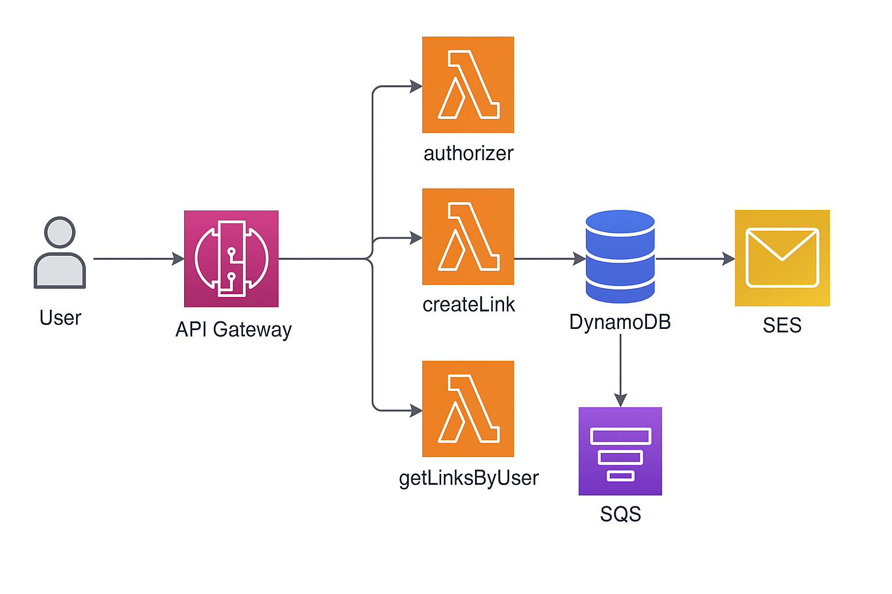

# SLS-Linker(SWAGGER link in the buttom)

SLS-Linker is a serverless application that enables users to register, log in, create short links, retrieve a list of their links, and deactivate links. It's built on AWS with a Node.js runtime, utilizing services like Lambda, DynamoDB, SES, and SQS.

---
## Architecture Diagram


---

## Features

- **User Registration**: Allows new users to register.
- **User Login**: Authentication for existing users.
- **Create Short Link**: Enables users to create shortened URLs.
- **Retrieve Links**: Users can fetch a list of all links they've created.
- **Deactivate Link**: Functionality to deactivate a specific link.

## Configuration

This application is configured for deployment on AWS with the following resources:

- **DynamoDB Tables**: `UsersTable` and `LinksTable` for storing user and link data.
- **Lambda Functions**:
    - `authorizer`: For token-based authorization.
    - `register`: User registration.
    - `login`: User login.
    - `createLink`: To create a new short link.
    - `getLinksByUser`: To retrieve links created by a user.
    - `getLinkFromShortUrl`: Redirects short URL to the original URL.
    - `linkDeactivation` & `deactivateLink`: Deactivates a specified link.
    - `sendEmailNotification`: Scheduled job for link deactivation.
- **IAM Role Statements**: Permissions for Lambda functions to interact with AWS services.
- **Environment Variables**: Including table names and JWT secret.

## Environment Setup

Before running or deploying this application, you need to set up your environment variables. An `.env.example` file is provided as a template. Create a `.env` file in the root of the project and fill in the necessary details.

Example `.env` file:

```plaintext
# .env.example

# Secret key for JWT token generation and verification
JWT_SECRET=your_jwt_secret

# AWS Configuration
AWS_ACCOUNT_ID=your_aws_account_id
AWS_REGION=your_aws_region

# Email Configuration
SENDER_EMAIL=your_email@example.com
```
Replace `your_jwt_secret`, `your_aws_account_id`, `your_aws_region`, and `your_email@example.com` with your actual AWS details and desired JWT secret.

## AWS CLI Configuration

To manage AWS resources used by this application, configure the AWS CLI with your credentials:

1. **Install AWS CLI**: If it's not already installed, download and install the AWS CLI from the [AWS website](https://aws.amazon.com/cli/).

2. **Configure AWS CLI**:
    - Open a terminal and run `aws configure`.
    - Enter your `AWS Access Key ID` and `AWS Secret Access Key`.
    - Specify the default region name (e.g., `us-east-1`) and output format (e.g., `json`).

## Deployment

Ensure you have AWS credentials configured and the Serverless Framework installed.

Deploy the application using the following command:
```bash
serverless deploy
```

## SwaggerHub documentation
[here is link](https://app.swaggerhub.com/apis/LipovskiyTeam/sls-linker_api/1.0.0).

** You can choose expiryPeriod = TEST for the link to be active for 1 minute (for testing).
